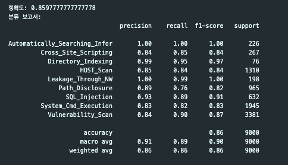
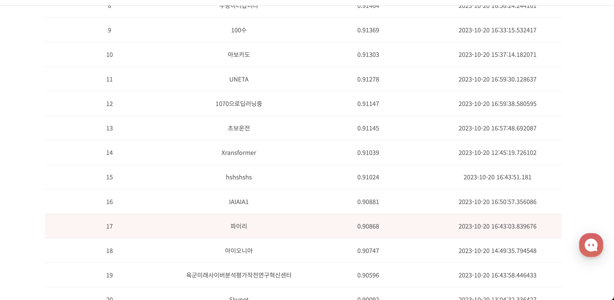

## KISA_AI_CHALLENGE(A-Track)   
(AI-빅데이터 챌린지)   

### Peformance Metric
- tfidf-svc 

- tfidf-word-xgboost

### Result
17/70 Accuracy : 90.868

### Reference
- Google Colab 사용법 / 딥러닝(머신러닝) 환경설정      
  https://yjs-program.tistory.com/124    
- HttpParamsDataset
https://www.kaggle.com/datasets/evg3n1j/httpparamsdataset
* source code : https://github.com/Morzeux/HttpParamsDataset
- Learning Text Classification - TextCNN
  https://www.kaggle.com/code/mlwhiz/learning-text-classification-textcnn/notebook
- A look at different embeddings...!
  https://www.kaggle.com/code/sudalairajkumar/a-look-at-different-embeddings/notebook
- 2DCNN textClassifier
  https://www.kaggle.com/code/yekenot/2dcnn-textclassifier/notebook  
- Fork of Mix of NN models
  https://www.kaggle.com/code/shujian/fork-of-mix-of-nn-models/notebook
  
